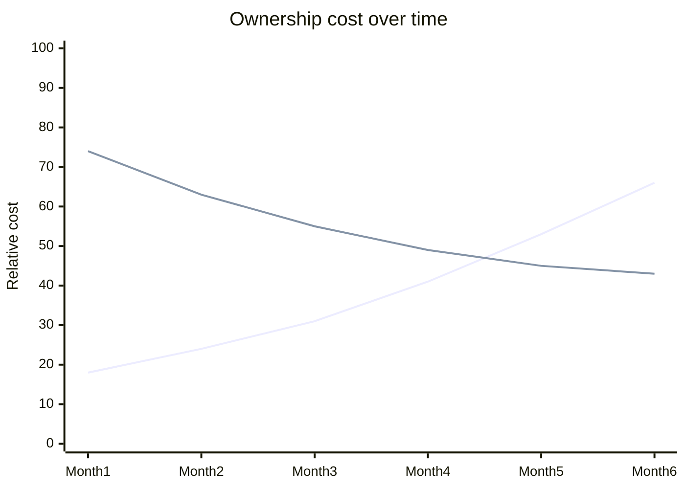

# Gems Are Efficient

1. I have problem.
2. Build or add gem?
3. Gem is cheap & easy
4. I add gem
<!--
- Let's track back. Why do we use gems?
- For a long time, this was just straightforward economics.
- I have a problem. I can build it myself, or I can add a gem. Building it myself is expensive. Adding a gem is cheap. So I add the gem.
- Take pagination. You're building a Rails app, you need pagination, you reach for Pagy, Kaminari, whatever. A few lines later, the problem is solved.
- And to be fair, for many years that was correct. The upfront cost of using a gem was tiny compared to the cost of learning the problem, implementing it well, and maintaining it yourself.
-->

---
layout: fact
---

# YAGNI

<!--
- Most importantly, using a gem means accepting the decisions made by maintainers who are solving a broader problem than the one I actually have. 
- A gem has to be useful to lots of people, in lots of apps, with lots of edge cases. My app usually does not. My app just needs one specific thing to work, in one specific context, with one set of constraints.
- I don't need pagination as a reusable abstraction for the Ruby ecosystem. I need next page and previous page in this app. And if you look at it that way, the cost model changes.
-->

---

# Build vs Buy

<!--
- The obvious response here is: fine, if the gem is too much, build it yourself. Or you know fork it.
- Most of the time, I do not actually want to reinvent the problem from first principles. 
- And neither do I want to inherit all the abstraction and ceremony that comes with maintainging a fork. 
- When I pull in a gem , I want the gem author's understanding of the problem - just without all the extra machinery that comes with packaging it up for the whole ecosystem.
-->

---
layout: full
class: cost-curve
---

<!--
- That is the interesting middle ground.
- I wanted a visual for this: two cost curves over time.
- Gems start cheap but often climb as maintenance and mismatch accumulate.
- In-house starts expensive, then flattens as fit and control improve.
- Copy-pasta distillation aims between those two extremes.
- Read the gem. Understand the part that solves the problem. Strip away the rest. Keep the smaller version locally.
-->
