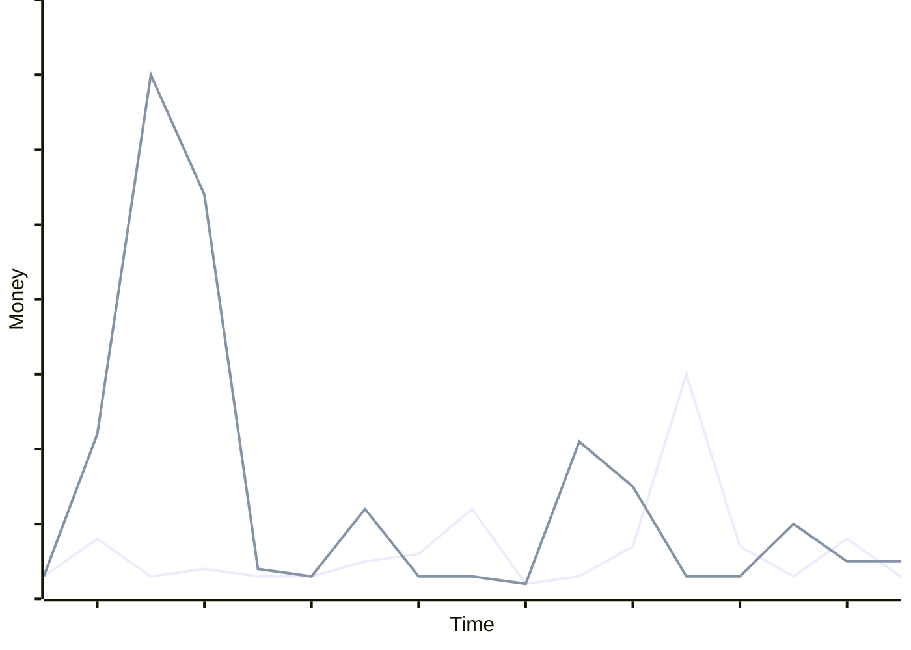

# Build or Buy?

<Versus :items="methodologyItems" separator="vs" />

<!--
- Let's track back and dig intow why we use gems?
- For a long time, this was just straightforward economics.
- I have a problem. What are my solutions to this problem?
- I can either use someone elses solution - in the form of a gem. 
- Or I can build it myself.
- And we know how that usually plays out. 
- The upfront cost of using a gem is tiny compared to the cost of learning the problem, implementing it well, and maintaining it yourself.
-->

---
layout: full
class: diagram
---

  ■ Gem
  vs
  ■ Custom

<!--
- So this is what it'd look like ususally
- Huge upfront cost for my custom solution
- And not so much for the gem.
- And yes, in the long run, there are costs
- I have to update my custom solution
- And here is that one time where the gem released new major version and it's interfaces changed
- And I had to hunt throughout the codebase to make everything work like that.
- That's just the baggage that comes with a gem.
- But let's, once agin, remind ourselves why we use a gem.
- Because we need a problem solved.
-->

---
layout: fact
---

# YAGNI

<!--
- The thing is, gems solve more than one problem. 
- The solve a lot of problems because gems want to be useful to lots of people. 
- But I don't need that. I want a specific problem solved, and everything else is YAGNI material.
- In our example, I don't need pagination as reusable solution for the entire community, I need a workable solution.
- Here is something we can optimize
-->

---
layout: quote
---

> A little copying is better than a little dependency.

— Rob Pike, Go Proverbs

<!--
- As they say, a little copying is better than a little dependency
- And that's exactly what we're going to do.
-->
